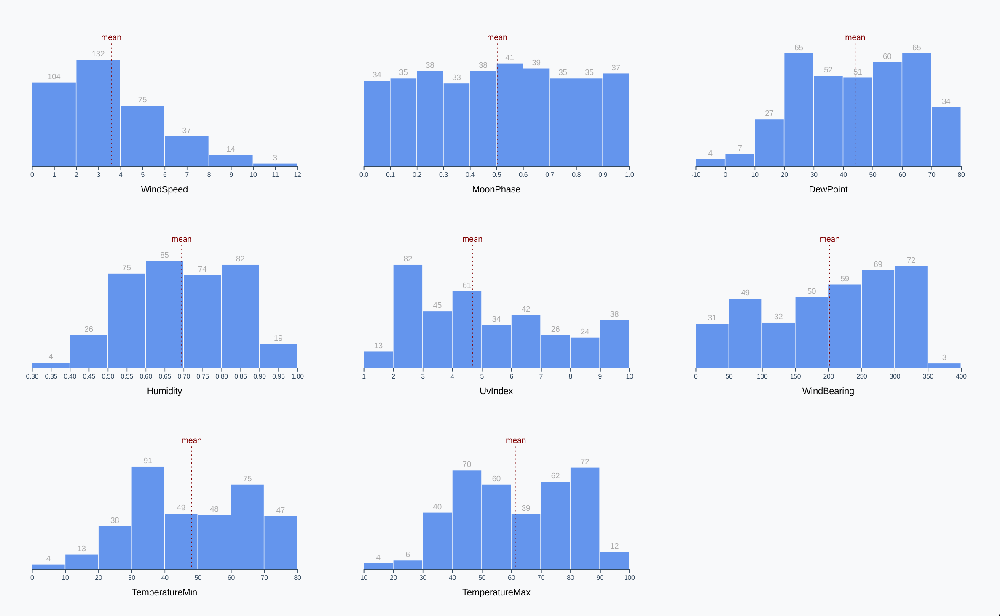

# Making a Bar Chart

- [Making a Bar Chart](#making-a-bar-chart)
  - [Deciding the chart type](#deciding-the-chart-type)
  - [Histogram](#histogram)
  - [Chart checklist](#chart-checklist)
  - [Access data](#access-data)
  - [Create dimensions](#create-dimensions)
  - [Draw the Canvas](#draw-the-canvas)
  - [Create scales](#create-scales)
    - [Creating Bins](#creating-bins)
    - [Creating the y scale](#creating-the-y-scale)
  - [Draw data](#draw-data)
  - [Adding Labels](#adding-labels)
  - [Draw peripherals](#draw-peripherals)
  - [Draw axes](#draw-axes)
  - [Multiple Metrics](#multiple-metrics)
  - [Accessibility](#accessibility)
  - [Interactivity](#interactivity)

We'll create a [bar chart](https://dataviz-exercises.netlify.app/bar-chart/index.html) using a histogram. We'll also generalize our histogram function and loop through eight metrics in our dataset - creating many histograms to compare.

## Deciding the chart type

Another question that we can ask our dataset is: what does the distribution of a metric look like?

For example:

- What kinds of humidity values do we have?
- Does the humidity level generally stay around one value, with a few very humid days and a few very dry days?
- Does it vary consistently, with no standard value?
- Or are there really humid days and really dry days, with none in-between?

Looking at the [scatter plot](https://dataviz-exercises.netlify.app/dew-point-interactive/index.html) we made, we can see the daily humidity values from the dots' vertical placement but it's hard to answer our questions - do most of our dots fall close the middle of the chart? We're not entirely sure.

Instead, let's make a histogram that plots a single metric - humidity.

## Histogram

A histogram is a bar chart that shows the distribution of one metric, with the metric values on the x axis and the frequency of values on the y axis.

In order to show the frequency, _values are placed in equally-sized bins_ (visualized as individual bars).

For example, we could make bins for dew point temperatures that span 10 degrees - these would look something like `[0-10, 10-20, 20-30, ...]`. A dew point of 15 degrees would be counted in the second bin: `10-20`.

The number of and size of bins is up to the implementor - you could have a histogram with only 3 bins or one with 100 bins. There are standards that can be followed - check out [d3's built-in formulas](https://github.com/d3/d3-array#bin-thresholds) and the [examples for bins](https://github.com/d3/d3-array#bins) - but we can generally decide the number based on what suits the data and what's easy to read.

Our goal to make a histogram of humidity values will show us the distribution of humidity values and help answer the questions:

- Do most days stay around the same level of humidity?
- Or are there two types of days: humid and dry? Are there extremely humid days?

## Chart checklist

To start, let's look over our chart-making checklist to remind ourselves of the necessary steps.

1. Access data
1. Create dimensions
1. Draw canvas
1. Create scales
1. Draw data
1. Draw peripherals
1. Set up interactions

## Access data

In our javascript file, let's grab the data from our JSON file, waiting until it's loaded to continue.

```js
const dataset = await d3.json("./data/my_weather_data.json");
```

This time we're only interested in one metric for the whole chart. Remember, the y axis is plotting the frequency (i.e. the number of occurrences) of the metric whose values are on the x axis. So instead of an `xAccessor()` and `yAccessor()`, we define a single metric accessor:

```js
async function drawBars() {
  // 1. Access data
  const dataset = await d3.json("./data/my_weather_data.json");

  const xAccessor = (d) => d.humidity;
}

drawBars();
```

## Create dimensions

Histograms are easiest to read when they are wider than they are tall. Let's set the width before defining the rest of our dimensions so we can use it to calculate the height. We'll also be able to quickly change the width later and keep the same aspect ratio for our chart.

Instead of filling the whole window, let's prepare for multiple histograms and keep our chart small. That way, the charts can stack horizontally and vertically, depending on the screen size.

```js
const width = 600;
```

Let's use the width to set the width and height of our chart. We'll leave a larger margin on the top to account for the bar labels, which we'll position above each bar.

```js
let dimensions = {
  width: width,
  height: width * 0.6,
  margin: {
    top: 30,
    right: 10,
    bottom: 50,
    left: 50,
  },
};
```

Our wrapper encompasses the whole chart. If we subtract our margins, we'll get the size of our bounds which contain any data elements.

Now that we know the size of our wrapper and margins, we can calculate the size of our bounds.

```js
dimensions.boundedWidth =
  dimensions.width - dimensions.margin.left - dimensions.margin.right;
dimensions.boundedHeight =
  dimensions.height - dimensions.margin.top - dimensions.margin.bottom;
```

Code so far:

```js
async function drawBars() {
  // 1. Access data
  const dataset = await d3.json("./data/my_weather_data.json");

  const xAccessor = (d) => d.humidity;

  // 2. Create chart dimensions
  const width = 600;
  let dimensions = {
    width: width,
    height: width * 0.6,
    margin: {
      top: 30,
      right: 10,
      bottom: 50,
      left: 50,
    },
  };
  dimensions.boundedWidth =
    dimensions.width - dimensions.margin.left - dimensions.margin.right;
  dimensions.boundedHeight =
    dimensions.height - dimensions.margin.top - dimensions.margin.bottom;
}

drawBars();
```

## Draw the Canvas

Create the wrapper element: select the existing element, add a new `<svg>` element and set its width and height:

```js
const wrapper = d3
  .select("#wrapper")
  .append("svg")
  .attr("width", dimensions.width)
  .attr("height", dimensions.height);
```

Bounds are a `<g>` element that will contain our main chart pieces and be shifted to respect our top and left margins:

```js
const bounds = wrapper
  .append("g")
  .style(
    "transform",
    `translate(${dimensions.margin.left}px, ${dimensions.margin.top}px)`
  );
```

## Create scales

Before we create our scales we'll split our data into equally-sized bins.

Our x scale will look similiar to the ones we've made in the past. We need a scale that will convert humidity levels into pixels-to-the-right. Since both the domain and the range are continuous numbers, we'll use `d3.scaleLinear()`.

We also use `.nice()` to make sure our axis starts and ends on round numbers.

```js
const xScale = d3
  .scaleLinear()
  .domain(d3.extent(dataset, xAccessor))
  .range([0, dimensions.boundedWidth])
  .nice();
```

> In order to review the above it may prove useful to log out the results of the range `console.log(xScale.range());` and domain `console.log(xScale.domain());` functions.

We can't make a `y` scale without knowing the range of frequencies we need to cover. We need to create our data bins first.

### Creating Bins

How do we split our data into bins and what size should those bins be? We could do this manually by looking at the domain and organizing our days into groups, but we'll use [d3-array](https://github.com/d3/d3-array#d3-array)'s [d3.bin()](https://github.com/d3/d3-array#bins) method to create a bin generator. This generator will convert our dataset into an array of bins - we can also choose how many bins we want.

Create a new generator:

```js
const binsGenerator = d3.bin();
```

Similar to making a scale, we pass a domain to the generator to tell it the range of numbers we want to cover.

```js
const binsGenerator = d3.bin().domain(xScale.domain());
```

Next, we'll need to tell our generator how to get the the humidity value, since our dataset contains objects instead of values. We can do this by passing our xAccessor function to the `.value()` method.

```js
const binsGenerator = d3.bin().domain(xScale.domain()).value(xAccessor);
```

We can also tell our generator that we want it to aim for a specific number of bins. We won't necessarily get the specified amount, but it will be close.

Let's aim for 13 bins — this should make sure we have enough granularity to see the shape of our distribution without too much noise. The number of bins is the number of thresholds + 1.

```js
const binsGenerator = d3
  .bin()
  .domain(xScale.domain())
  .value(xAccessor)
  .thresholds(12);
```

Here's the long form for clarity:

```js
const binsGenerator = d3
  .bin()
  .domain(d3.extent(dataset, xAccessor))
  .value((d) => d.length)
  .thresholds(12);
```

Create the bins by feeding it our data.

```js
const bins = binsGenerator(dataset);
```

Take a look at these bins by logging them: `console.log(bins)`.

Each bin is an array with the following structure:

- each item is a matching data point
- there is an x0 key that shows the lower bound of included humidity values
- there is an x1 key that shows the upper bound of included humidity values - a bin with a x1 value of 1 will include values up to 1, but not 1 itself
- there is a length property

> If you want, you can specify an exact number of bins by passing an array of thresholds. For example, we could specify 5 bins with `.thresholds([0, 0.2, 0.4, 0.6, 0.8, 1])`.

### Creating the y scale

We can use these bins to create our y scale. First, let's create a y accessor function and place it at the top of our file. Now that we know the shape of the data that we'll use to create our data elements, we can specify how to access the y value in one place.

```js
const yAccessor = (d) => d.length;
```

Let's use our new accessor function and our bins to create the y scale. As usual, we'll want to make a linear scale. This time, however, we'll want to start our y axis at zero.

Previously, we wanted to represent the extent of our data since we were plotting metrics that had no logical bounds (temperature and humidity level). But the number of days that fall in a bin is bounded at 0 — you can't have negative days in a bin.

Instead of using `d3.extent()`, we can use another method from d3-array: `d3.max()`. We've used its counterpart, `d3.min()`. `d3.max()` takes the same arguments: an array and an accessor function.

Note that we're passing `d3.max()` our bins instead of our original dataset — we want to find the maximum number of days in a bin, which is only available in our computed bins array.

Let's use `.nice()` here as well to give our bars a round top number.

```js
const yScale = d3
  .scaleLinear()
  .domain([0, d3.max(bins, yAccessor)])
  .range([dimensions.boundedHeight, 0])
  .nice();
```

Code so far:

```js
async function drawBars() {
  // 1. Access data
  const dataset = await d3.json("./data/my_weather_data.json");

  const xAccessor = (d) => d.humidity;
  const yAccessor = (d) => d.length;

  // 2. Create chart dimensions

  const width = 600;
  let dimensions = {
    width: width,
    height: width * 0.6,
    margin: {
      top: 30,
      right: 10,
      bottom: 50,
      left: 50,
    },
  };
  dimensions.boundedWidth =
    dimensions.width - dimensions.margin.left - dimensions.margin.right;
  dimensions.boundedHeight =
    dimensions.height - dimensions.margin.top - dimensions.margin.bottom;

  // 3. Draw canvas

  const wrapper = d3
    .select("#wrapper")
    .append("svg")
    .attr("width", dimensions.width)
    .attr("height", dimensions.height);

  const bounds = wrapper
    .append("g")
    .style(
      "transform",
      `translate(${dimensions.margin.left}px, ${dimensions.margin.top}px)`
    );

  // 4. Create scales

  const xScale = d3
    .scaleLinear()
    .domain(d3.extent(dataset, xAccessor))
    .range([0, dimensions.boundedWidth])
    .nice();

  const binsGenerator = d3
    .bin()
    .domain(xScale.domain())
    .value(xAccessor)
    .thresholds(12);

  const bins = binsGenerator(dataset);

  const yScale = d3
    .scaleLinear()
    .domain([0, d3.max(bins, yAccessor)])
    .range([dimensions.boundedHeight, 0])
    .nice();
}

drawBars();
```

## Draw data

We draw our bars in groups so we can position them (as well as labels).

Our plan is to create one bar for each bin, with a label on top of each bar.

We'll need one bar for each item in our bins array — this is a sign that we'll want to use the data bind concept.

Let's first create a `<g>` element to contain our bins. This will help keep our code organized and isolate our bars in the DOM.

```js
const binsGroup = bounds.append("g");
```

Because we have more than one element, we'll bind each data point to a `<g>` SVG element. This will let us group each bin's bar and label.

To start, we'll select all existing `<g>` elements within our binsGroup (there aren't any yet, but we're creating a selection object that points to the right place). Then we'll use `.data()` to bind our bins to the selection.

```js
const binGroups = binsGroup.selectAll("g").data(bins);
```

Next, we'll create our `<g>` elements, using `.join()` to target all of our bins.

```js
const binGroups = binsGroup.selectAll("g").data(bins).join("g");
```

Examine the svg in dev tools. The above creates one new `<g>` element for each bin. We're going to place our bars within these groups.

Next we'll draw our bars, but first we should calculate any constants that we'll need.

In this case, the only constant that we can set ahead of time is the padding between bars. Giving them some space helps distinguish individual bars, but we don't want them too far apart - that will make them hard to compare and take away from the overall shape of the distribution.

```js
const barPadding = 1;
```

Each bar is a rectangle, so we'll append a `<rect>` to each of our `<g>` elements.

```js
const barRects = binGroups.append("rect");
```

Remember, `<rect>`s need four attributes: x, y, width, and height.

Let's start with the x value, which corresponds to the left side of the bar. The bar will start at the lower bound of the bin, which we can find at the `x0` key.

But `x0` is a humidity level, not a pixel. So let's use `xScale()` to convert it to pixel space.

We also need to offset it by the `barPadding` we set earlier.

```js
const barRects = binGroups
  .append("rect")
  .attr("x", (d) => xScale(d.x0) + barPadding / 2)
  .attr("y", (d) => yScale(yAccessor(d)));
```

Next, we'll specify the `<rect>`'s y attribute which corresponds to the top of the bar. We'll use our `yAccessor()` to grab the frequency and use our scale to convert it into pixel space.

```js
.attr("y", d => yScale(yAccessor(d)))
```

To find the width of a bar, we need to subtract the `x0` position of the left side of the bar from the `x1` position of the right side of the bar.

We'll need to subtract the bar padding from the total width to account for spaces between bars. Sometimes we'll get a bar with a width of 0, and subtracting the barPadding will bring us to -1. To prevent passing our `<rect>`s a negative width, we'll wrap our value with d3.max([0, width]).

```js
.attr("width", d => d3.max([0, xScale(d.x1) - xScale(d.x0) - barPadding
]))
```

Lastly, we'll calculate the bar's height by subtracting the y value from the bottom of the y axis. Since our y axis starts from 0, we can use our boundedHeight.

```js
.attr("height", d => dimensions.boundedHeight - yScale(yAccessor(d)))
```

Put that all together and change the bar fill to blue:

```js
const barRects = binGroups
  .append("rect")
  .attr("x", (d) => xScale(d.x0) + barPadding / 2)
  .attr("y", (d) => yScale(yAccessor(d)))
  .attr("width", (d) => d3.max([0, xScale(d.x1) - xScale(d.x0) - barPadding]))
  .attr("height", (d) => dimensions.boundedHeight - yScale(yAccessor(d)))
  .attr("fill", "cornflowerblue");
```

Now we're starting to see the beginnings of our histogram.

Final code for this part:

```js
async function drawBars() {
  // 1. Access data
  const dataset = await d3.json("./data/my_weather_data.json");

  const xAccessor = (d) => d.humidity;
  const yAccessor = (d) => d.length;

  // 2. Create chart dimensions

  const width = 600;
  let dimensions = {
    width: width,
    height: width * 0.6,
    margin: {
      top: 30,
      right: 10,
      bottom: 50,
      left: 50,
    },
  };
  dimensions.boundedWidth =
    dimensions.width - dimensions.margin.left - dimensions.margin.right;
  dimensions.boundedHeight =
    dimensions.height - dimensions.margin.top - dimensions.margin.bottom;

  // 3. Draw canvas

  const wrapper = d3
    .select("#wrapper")
    .append("svg")
    .attr("width", dimensions.width)
    .attr("height", dimensions.height);

  const bounds = wrapper
    .append("g")
    .style(
      "transform",
      `translate(${dimensions.margin.left}px, ${dimensions.margin.top}px)`
    );

  // 4. Create scales

  const xScale = d3
    .scaleLinear()
    .domain(d3.extent(dataset, xAccessor))
    .range([0, dimensions.boundedWidth])
    .nice();

  const binsGenerator = d3
    .bin()
    .domain(xScale.domain())
    .value(xAccessor)
    .thresholds(12);

  const bins = binsGenerator(dataset);

  const yScale = d3
    .scaleLinear()
    .domain([0, d3.max(bins, yAccessor)])
    .range([dimensions.boundedHeight, 0])
    .nice();

  // 5. Draw data

  const binsGroup = bounds.append("g");

  const binGroups = binsGroup.selectAll("g").data(bins).join("g");

  const barPadding = 1;
  const barRects = binGroups
    .append("rect")
    .attr("x", (d) => xScale(d.x0) + barPadding / 2)
    .attr("y", (d) => yScale(yAccessor(d)))
    .attr("width", (d) => d3.max([0, xScale(d.x1) - xScale(d.x0) - barPadding]))
    .attr("height", (d) => dimensions.boundedHeight - yScale(yAccessor(d)))
    .attr("fill", "cornflowerblue");
}
drawBars();
```

## Adding Labels

Draw a label over each bar, showing the number of points within that bin.

We can keep our chart clean by only adding labels to bins with any relevant days — having 0s in empty spaces is visual clutter. We can identify which bins have no data by their lack of a bar, no need to call it out with a label.

d3 selections have a `.filter()` method that acts the same way the native Array method does. `.filter()` accepts one parameter: a function that accepts one data point and returns a value. Any items in our dataset that return a falsey value will be removed.

> By "falsey", we're referring to any value that evaluates to false. This includes values other than false, such as `0, null, undefined, "", and NaN`. Bear in mind that empty arrays `[]` and object `{}` evaluate to truthy. If you're curious, [read more here](https://developer.mozilla.org/en-US/docs/Glossary/Falsy).

We can use `yAccessor()` as shorthand for `d => yAccessor(d) != 0` because `0` is falsey.

```js
const barText = binGroups.filter(yAccessor);
```

Since these labels are just text, we'll want to use the SVG `<text>` element we've been using for our axis labels.

```js
const barText = binGroups.filter(yAccessor).append("text");
```

Remember,` <text>` elements are positioned with x and y attributes. The label will be centered horizontally above the bar — we can find the center of the bar by adding half of the bar's width (the right side minus the left side) to the left side of the bar.

```js
const barText = binGroups
  .filter(yAccessor)
  .append("text")
  .attr("x", (d) => xScale(d.x0) + (xScale(d.x1) - xScale(d.x0)) / 2);
```

Our `<text>`'s y position will be similar to the `<rect>`'s y position, but let's shift it up by 5 pixels to add a little gap.

```js
const barText = binGroups
  .filter(yAccessor)
  .append("text")
  .attr("x", (d) => xScale(d.x0) + (xScale(d.x1) - xScale(d.x0)) / 2)
  .attr("y", (d) => yScale(yAccessor(d)) - 5);
```

Next, we'll display the count of days in the bin using our `yAccessor()` function.

```js
const barText = binGroups
  .filter(yAccessor)
  .append("text")
  .attr("x", (d) => xScale(d.x0) + (xScale(d.x1) - xScale(d.x0)) / 2)
  .attr("y", (d) => yScale(yAccessor(d)) - 5)
  .text(yAccessor);
```

Use the CSS text-anchor property to horizontally align the text — this is a much simpler solution than compensating for text width when we set the x attribute.

```js
const barText = binGroups
  .filter(yAccessor)
  .append("text")
  .attr("x", (d) => xScale(d.x0) + (xScale(d.x1) - xScale(d.x0)) / 2)
  .attr("y", (d) => yScale(yAccessor(d)) - 5)
  .text(yAccessor)
  .style("text-anchor", "middle");
```

Add a few styles to decrease the visual importance of our labels:

```js
const barText = binGroups
  .filter(yAccessor)
  .append("text")
  .attr("x", (d) => xScale(d.x0) + (xScale(d.x1) - xScale(d.x0)) / 2)
  .attr("y", (d) => yScale(yAccessor(d)) - 5)
  .text(yAccessor)
  .style("text-anchor", "middle")
  .attr("fill", "darkgrey")
  .style("font-size", "12px")
  .style("font-family", "sans-serif");
```

We should see the count of days for each of our bars.

Final code:

```js
async function drawBars() {
  // 1. Access data
  const dataset = await d3.json("./data/my_weather_data.json");

  const xAccessor = (d) => d.humidity;
  const yAccessor = (d) => d.length;

  // 2. Create chart dimensions

  const width = 600;
  let dimensions = {
    width: width,
    height: width * 0.6,
    margin: {
      top: 30,
      right: 10,
      bottom: 50,
      left: 50,
    },
  };
  dimensions.boundedWidth =
    dimensions.width - dimensions.margin.left - dimensions.margin.right;
  dimensions.boundedHeight =
    dimensions.height - dimensions.margin.top - dimensions.margin.bottom;

  // 3. Draw canvas

  const wrapper = d3
    .select("#wrapper")
    .append("svg")
    .attr("width", dimensions.width)
    .attr("height", dimensions.height);

  const bounds = wrapper
    .append("g")
    .style(
      "transform",
      `translate(${dimensions.margin.left}px, ${dimensions.margin.top}px)`
    );

  // 4. Create scales

  const xScale = d3
    .scaleLinear()
    .domain(d3.extent(dataset, xAccessor))
    .range([0, dimensions.boundedWidth])
    .nice();

  const binsGenerator = d3
    .bin()
    .domain(xScale.domain())
    .value(xAccessor)
    .thresholds(12);

  const bins = binsGenerator(dataset);

  const yScale = d3
    .scaleLinear()
    .domain([0, d3.max(bins, yAccessor)])
    .range([dimensions.boundedHeight, 0])
    .nice();

  // 5. Draw data

  const binsGroup = bounds.append("g");

  const binGroups = binsGroup.selectAll("g").data(bins).join("g");

  const barPadding = 1;
  const barRects = binGroups
    .append("rect")
    .attr("x", (d) => xScale(d.x0) + barPadding / 2)
    .attr("y", (d) => yScale(yAccessor(d)))
    .attr("width", (d) => d3.max([0, xScale(d.x1) - xScale(d.x0) - barPadding]))
    .attr("height", (d) => dimensions.boundedHeight - yScale(yAccessor(d)))
    .attr("fill", "cornflowerblue");

  const barText = binGroups
    .filter(yAccessor)
    .append("text")
    .attr("x", (d) => xScale(d.x0) + (xScale(d.x1) - xScale(d.x0)) / 2)
    .attr("y", (d) => yScale(yAccessor(d)) - 5)
    .text(yAccessor)
    .style("text-anchor", "middle")
    .attr("fill", "darkgrey")
    .style("font-size", "12px")
    .style("font-family", "sans-serif");
}
drawBars();
```

## Draw peripherals

Draw a line depicting the mean of our distribution, as well as our axes.

When looking at the shape of a distribution, it can be helpful to know where the mean is.

The mean is just the average — the center of a set of numbers. To calculate the mean, you would divide the sum by the number of values. For example, the mean of `[1, 2, 3, 4, 5]` would be `(1 + 2 + 3 + 4 + 5) / 5 = 3`.

Instead of calculating the mean by hand, we can use `d3.mean()` to get the value. Like many d3 methods we've used, we pass the dataset as the first parameter and an optional accessor function as the second.

```js
const mean = d3.mean(dataset, xAccessor);
```

We'll use an SVG `<line>` to draw a line between two points: `[x1, y1]` and `[x2, y2]`.

Let's add a line to our bounds that is:

- at the mean humidity level,
- starting 15px above our chart, and
- ending at our x axis.

```js
const meanLine = bounds
  .append("line")
  .attr("x1", xScale(mean))
  .attr("x2", xScale(mean))
  .attr("y1", -15)
  .attr("y2", dimensions.boundedHeight);
```

Let's add some styles to the line so we can see it (by default, `<line>`s have no stroke color) and to distinguish it from an axis. SVG element strokes can be split into dashes with the `stroke-dasharray` attribute. The lines alternate between the stroke color and transparent, starting with transparent. We define the line lengths with a space-separated list of values which will be repeated until the line is drawn.

Let's make our lines dashed with a 2px long maroon dash and a 4px long gap.

```js
const meanLine = bounds
  .append("line")
  .attr("x1", xScale(mean))
  .attr("x2", xScale(mean))
  .attr("y1", -15)
  .attr("y2", dimensions.boundedHeight)
  .attr("stroke-width", "2px")
  .attr("stroke", "maroon")
  .attr("stroke-dasharray", "2px 4px");
```

Let's label our line to clarify to readers what it represents. We'll want to add a `<text>` element in the same position as our line, but 5 pixels higher to give a little gap.

```js
const meanLabel = bounds
  .append("text")
  .attr("x", xScale(mean))
  .attr("y", -20)
  .text("mean")
  .attr("fill", "maroon")
  .style("font-size", "12px");
```

We can see the text but it isn't horizontally centered with our line.

Let's center our text by adding the CSS property text-anchor: middle. This is a property specifically for setting the horizontal alignment of text in SVG.

```js
const meanLabel = bounds
  .append("text")
  .attr("x", xScale(mean))
  .attr("y", -20)
  .text(`mean ${mean}`)
  .attr("fill", "maroon")
  .style("font-size", "12px")
  .style("text-anchor", "middle")
  .style("font-family", "sans-serif");
```

Now our mean line is clear to our readers.

## Draw axes

Our next task here is to draw our axes. Since we're labeling the y value of each of our bars, we won't need a y axis. We just need an x axis.

We'll start by making our axis generator — our axis will be along the bottom of the chart so we'll be using `d3.axisBottom()`.

```js
const xAxisGenerator = d3.axisBottom().scale(xScale);
```

Then we'll use our new axis generator to create an axis, then shift it below our bounds.

```js
const xAxis = bounds
  .append("g")
  .call(xAxisGenerator)
  .style("transform", `translateY(${dimensions.boundedHeight}px)`);
```

Add a label to make it clear what the tick labels represent:

```js
const xAxisLabel = xAxis
  .append("text")
  .attr("x", dimensions.boundedWidth / 2)
  .attr("y", dimensions.margin.bottom - 10)
  .attr("fill", "black")
  .style("font-size", "1.4em")
  .text("Humidity");
```

Final code:

```js
async function drawBars() {
  // 1. Access data
  const dataset = await d3.json("./data/my_weather_data.json");

  const xAccessor = (d) => d.humidity;
  const yAccessor = (d) => d.length;

  // 2. Create chart dimensions

  const width = 600;
  let dimensions = {
    width: width,
    height: width * 0.6,
    margin: {
      top: 30,
      right: 10,
      bottom: 50,
      left: 50,
    },
  };
  dimensions.boundedWidth =
    dimensions.width - dimensions.margin.left - dimensions.margin.right;
  dimensions.boundedHeight =
    dimensions.height - dimensions.margin.top - dimensions.margin.bottom;

  // 3. Draw canvas

  const wrapper = d3
    .select("#wrapper")
    .append("svg")
    .attr("width", dimensions.width)
    .attr("height", dimensions.height);

  const bounds = wrapper
    .append("g")
    .style(
      "transform",
      `translate(${dimensions.margin.left}px, ${dimensions.margin.top}px)`
    );

  // 4. Create scales

  const xScale = d3
    .scaleLinear()
    .domain(d3.extent(dataset, xAccessor))
    .range([0, dimensions.boundedWidth])
    .nice();

  const binsGenerator = d3
    .bin()
    .domain(xScale.domain())
    .value(xAccessor)
    .thresholds(12);

  const bins = binsGenerator(dataset);

  const yScale = d3
    .scaleLinear()
    .domain([0, d3.max(bins, yAccessor)])
    .range([dimensions.boundedHeight, 0])
    .nice();

  // 5. Draw data

  const binsGroup = bounds.append("g");

  const binGroups = binsGroup.selectAll("g").data(bins).join("g");

  const barPadding = 1;
  const barRects = binGroups
    .append("rect")
    .attr("x", (d) => xScale(d.x0) + barPadding / 2)
    .attr("y", (d) => yScale(yAccessor(d)))
    .attr("width", (d) => d3.max([0, xScale(d.x1) - xScale(d.x0) - barPadding]))
    .attr("height", (d) => dimensions.boundedHeight - yScale(yAccessor(d)))
    .attr("fill", "cornflowerblue");

  const barText = binGroups
    .filter(yAccessor)
    .append("text")
    .attr("x", (d) => xScale(d.x0) + (xScale(d.x1) - xScale(d.x0)) / 2)
    .attr("y", (d) => yScale(yAccessor(d)) - 5)
    .text(yAccessor)
    .style("text-anchor", "middle")
    .attr("fill", "darkgrey")
    .style("font-size", "12px")
    .style("font-family", "sans-serif");

  // 6. Draw peripherals

  const mean = d3.mean(dataset, xAccessor);
  const meanLine = bounds
    .append("line")
    .attr("x1", xScale(mean))
    .attr("x2", xScale(mean))
    .attr("y1", -15)
    .attr("y2", dimensions.boundedHeight)
    .attr("stroke", "maroon")
    .attr("stroke-dasharray", "2px 4px");

  const meanLabel = bounds
    .append("text")
    .attr("x", xScale(mean))
    .attr("y", -20)
    .text("mean")
    .attr("fill", "maroon")
    .style("font-size", "12px")
    .style("text-anchor", "middle")
    .style("font-family", "sans-serif");

  const xAxisGenerator = d3.axisBottom().scale(xScale);

  const xAxis = bounds
    .append("g")
    .call(xAxisGenerator)
    .style("transform", `translateY(${dimensions.boundedHeight}px)`);

  const xAxisLabel = xAxis
    .append("text")
    .attr("x", dimensions.boundedWidth / 2)
    .attr("y", dimensions.margin.bottom - 10)
    .attr("fill", "black")
    .style("font-size", "1.4em")
    .text("Humidity");
}
drawBars();
```

## Multiple Metrics

Note: save `chart.js` as `charts.js` into the same directory and change the HTML file so it links to `charts.js`.

Generalizing our histogram drawing function and creating a chart for each weather metric we have access to will make sure that we understand what every line of code is doing.

Generalizing our code will also help us to start thinking about handling dynamic data — a core concept when building a dashboard. Drawing a graph with a specific dataset can be difficult, but you get to rely on values being the same every time your code runs. When handling data from an API, your charting functions need to be more robust and able to handle very different datasets.



We won't need to rewrite the majority of our code. The main difference is that we'll wrap most of the chart drawing into a new function called `drawHistogram()`.

Which steps do we need to repeat for every chart? Look at our checklist again:

1. Access data
2. Create dimensions
3. Draw canvas
4. Create scales
5. Draw data
6. Draw peripherals
7. Set up interactions

All of the histograms will use the same dataset, so we can skip step 1. And every chart will be the same size, so we don't need to repeat step 2 either. However, we want each chart to have its own svg element, so we'll need to wrap everything after step 2 .

We'll create a new function called `drawHistogram()` that contains all of our code, starting at the point we create our svg.

```js
const drawHistogram = () => {
    const wrapper = d3.select("#wrapper")
    // ...  the rest of our chart code
```

What parameters does our function need? The only difference between these charts is the metric we're plotting, so let's add that as an argument.

```js
const drawHistogram = (metric) => {
    // ...
```

We need to use the metric to update our `metricAccessor()`. Let's grab our accessor functions from our Access data step and throw them at the top of our new function. We'll also need our `metricAccessor()` to return the provided metric, instead of hard-coding `d.humidity`.

```js
const drawHistogram = (metric) => {
    const metricAccessor = d => d[metric]
    const yAccessor = d => d.length

    const wrapper = d3.select("#wrapper")
    // ...
```

Instead of using `xAccessor` in the balance of our code we need to use `metricAccessor`.

In our scale and bins generator:

```js
const xScale = d3
  .scaleLinear()
  .domain(d3.extent(dataset, metricAccessor))
  .range([0, dimensions.boundedWidth])
  .nice();

const binsGenerator = d3
  .bin()
  .domain(xScale.domain())
  .value(metricAccessor)
  .thresholds(8);
```

And in our mean:

```js
const mean = d3.mean(dataset, metricAccessor);
```

At the bottom of our `drawBars()` function, let's run through some of the available metrics and pass each of them to our new generalized function.

```js
const metrics = [
  "windSpeed",
  "moonPhase",
  "dewPoint",
  "humidity",
  "uvIndex",
  "windBearing",
  "temperatureMin",
  "temperatureMax",
  "visibility",
  "cloudCover",
];

metrics.forEach(drawHistogram);
```

Refresh the page.

We see multiple histograms, but the label is incorrect. Not all of these charts are showing Humidity. Find the line where we set our x axis label:

```js
const xAxisLabel = xAxis
  .append("text")
  //  ...
  .text("Humidity");
```

And update it to show our metric instead.

We'll set the text to our metric instead, and we can also add a CSS text-transform value to help format our metric names.

```js
const xAxisLabel = xAxis
  .append("text")
  // ...
  .text(metric)
  .style("text-transform", "capitalize");
```

When we refresh our webpage, we should see our finished histograms.

Take a second and observe the variety of shapes of these histograms. What are some insights we can discover when looking at our data in this format?

- the moon phase distribution is flat - this makes sense because it's cyclical, consistently going through the same steps all year.
- our wind speed is usually around 3 mph, with a long tail to the right that represents a few very windy days. Some days have no wind at all, with an average wind speed of 0.
- our max temperatures seem almost bimodal, with the mean falling in between two humps. Looks like New York City spends more days with relatively extreme temperatures (30°F - 50°F or 70°F - 90°F) than with more temperate weather (60°F).

Code:

```js
async function drawBars() {
  // 1. Access data
  const dataset = await d3.json("./data/my_weather_data.json");

  // 2. Create chart dimensions

  const width = 500;
  let dimensions = {
    width: width,
    height: width * 0.6,
    margin: {
      top: 80,
      right: 50,
      bottom: 50,
      left: 50,
    },
  };
  dimensions.boundedWidth =
    dimensions.width - dimensions.margin.left - dimensions.margin.right;
  dimensions.boundedHeight =
    dimensions.height - dimensions.margin.top - dimensions.margin.bottom;

  const drawHistogram = (metric) => {
    const metricAccessor = (d) => d[metric];
    const yAccessor = (d) => d.length;

    // 3. Draw canvas

    const wrapper = d3
      .select("#wrapper")
      .append("svg")
      .attr("width", dimensions.width)
      .attr("height", dimensions.height);

    const bounds = wrapper
      .append("g")
      .style(
        "transform",
        `translate(${dimensions.margin.left}px, ${dimensions.margin.top}px)`
      );

    // 4. Create scales

    const xScale = d3
      .scaleLinear()
      .domain(d3.extent(dataset, metricAccessor))
      .range([0, dimensions.boundedWidth])
      .nice();

    const binsGenerator = d3
      .bin()
      .domain(xScale.domain())
      .value(metricAccessor)
      .thresholds(8);

    const bins = binsGenerator(dataset);

    const yScale = d3
      .scaleLinear()
      .domain([0, d3.max(bins, yAccessor)])
      .range([dimensions.boundedHeight, 0])
      .nice();

    // 5. Draw data

    const binGroups = bounds.selectAll("g").data(bins).enter().append("g");

    const barPadding = 1;
    const barRects = binGroups
      .append("rect")
      .attr("x", (d) => xScale(d.x0) + barPadding / 2)
      .attr("y", (d) => yScale(yAccessor(d)))
      .attr("width", (d) =>
        d3.max([0, xScale(d.x1) - xScale(d.x0) - barPadding])
      )
      .attr("height", (d) => dimensions.boundedHeight - yScale(yAccessor(d)))
      .attr("fill", "cornflowerblue");

    const barText = binGroups
      .filter(yAccessor)
      .append("text")
      .attr("x", (d) => xScale(d.x0) + (xScale(d.x1) - xScale(d.x0)) / 2)
      .attr("y", (d) => yScale(yAccessor(d)) - 5)
      .text(yAccessor)
      .style("text-anchor", "middle")
      .attr("fill", "darkgrey")
      .style("font-size", "12px")
      .style("font-family", "sans-serif");

    const mean = d3.mean(dataset, metricAccessor);
    const meanLine = bounds
      .append("line")
      .attr("x1", xScale(mean))
      .attr("x2", xScale(mean))
      .attr("y1", -15)
      .attr("y2", dimensions.boundedHeight)
      .attr("stroke", "maroon")
      .attr("stroke-dasharray", "2px 4px");

    const meanLabel = bounds
      .append("text")
      .attr("x", xScale(mean))
      .attr("y", -20)
      .text("mean")
      .attr("fill", "maroon")
      .style("font-size", "12px")
      .style("text-anchor", "middle");

    // 6. Draw peripherals

    const xAxisGenerator = d3.axisBottom().scale(xScale);

    const xAxis = bounds
      .append("g")
      .call(xAxisGenerator)
      .style("transform", `translateY(${dimensions.boundedHeight}px)`);

    const xAxisLabel = xAxis
      .append("text")
      .attr("x", dimensions.boundedWidth / 2)
      .attr("y", dimensions.margin.bottom - 10)
      .attr("fill", "black")
      .style("font-size", "1.4em")
      .text(metric);
  };

  const metrics = [
    "windSpeed",
    "moonPhase",
    "dewPoint",
    "humidity",
    "uvIndex",
    "windBearing",
    "temperatureMin",
    "temperatureMax",
    "visibility",
    "cloudCover",
  ];

  metrics.forEach(drawHistogram);
}
drawBars();
```

## Accessibility

Note: switch back to `chart.js` (the single chart version of this exercise) before proceeding for simplicity. We'll be updating our completed single histogram in this section, without the extra histograms.

Let's look at the ways to make our charts accessible to screen readers.

The main goal of any data visualization is for it to be readable. This generally means that we want our elements to be easy to see, text is large enough to read, colors have enough contrast, etc. But what about users who access web pages through screen readers?

We can actually make our charts accessible at a basic level, without a lot of effort. Let's update our histogram so that it's accessible with a screen reader.

If you want to test this out, download the ChromeVox extension for chrome (or see [these instructions](https://gomakethings.com/you-should-use-a-screen-reader/)). If we test it out on our histogram, you'll notice that it doesn't give much information, other than reading all of the text in our chart. That's not an ideal experience.

The main standard for making websites accessible is from WAI-ARIA, the Accessible Rich Internet Applications Suite. WAI-ARIA roles, set using a role attribute, tell the screen reader what type of content an element is.

The first thing we can do is to give our `<svg>` element a role of figure, to alert it that this element is a chart. (This code can go at the bottom of the Draw canvas step).

```js
wrapper.attr("role", "figure");
```

Next, we can make our chart tabable, by adding a tabindex of 0. This will make it so that a user can hit tab to highlight our chart.

There are only two tabindex values that you should use:

- 0, which puts an element in the tab flow, in DOM order
- -1, which takes an element out of the tab flow.

```js
wrapper.attr("role", "figure").attr("tabindex", "0");
```

When a user tabs to our chart, we want the screen reader to announce the basic layout so the user knows what they're "looking" at. To do this, we can add a `<title>` SVG component with a short description.

```js
wrapper
  .append("title")
  .text("Histogram looking at the distribution of humidity in 2016");
```

If you have a screen reader set up, you'll notice that it will read our `<title>` when we tab to our chart.

Next, we'll want to make our `binsGroup` selectable by also giving it a tabindex of 0. If the user presses tab after the wrapper is focused, the browser will focus on the binsGroup because it's the next element (in DOM order) that is focusable.

```js
const binsGroup = bounds.append("g").attr("tabindex", "0");
```

We can also give our binsGroup a role of "list", which will make the screen reader announce the number of items within the list. And we'll let the user know what the list contains by adding an aria-label.

```js
const binsGroup = bounds
  .append("g")
  .attr("tabindex", "0")
  .attr("role", "list")
  .attr("aria-label", "histogram bars");
```

Now when our binsGroup is highlighted, the screen reader will announce: "histogram bars. List with 15 items".

Let's annotate each of our "list items". After we create our binGroups, we'll add a few attributes to each group:

- make it focusable with a tabindex of 0
- give it a role of "listitem"
- give it an area-label that the screen reader will announce when the item is focused.

```js
const binGroups = binsGroup
  .selectAll("g")
  .data(bins)
  .enter()
  .append("g")
  .attr("tabindex", "0")
  .attr("role", "listitem")
  .attr(
    "aria-label",
    (d) =>
      `There were ${yAccessor(d)} days between ${d.x0
        .toString()
        .slice(0, 4)} and ${d.x1.toString().slice(0, 4)} humidity levels.`
  );
```

Now when we tab out of our binsGroup, it will focus the first bar group (and subsequent ones when we tab) and announce our aria label.

We'll tackle one last issue — the screen reader reads each of our x-axis tick labels once it's done reading our `<title>`. This is annoying, and not giving the user much information.

At the bottom of our `drawBars()` function, select all of the text within the chart and give it an aria-hidden attribute of "true".

```js
wrapper
  .selectAll("text")
  .attr("role", "presentation")
  .attr("aria-hidden", "true");
```

Now our screen reader will read only our labels and ignore any `<text>` elements within our chart.

With just a little effort, we've made our chart accessible to any users who access the web through a screen reader.

Final code:

```js
async function drawBars() {
  // 1. Access data
  const dataset = await d3.json("./data/my_weather_data.json");

  const metricAccessor = (d) => d.humidity;
  const yAccessor = (d) => d.length;

  // 2. Create chart dimensions

  const width = 600;
  let dimensions = {
    width: width,
    height: width * 0.6,
    margin: {
      top: 30,
      right: 10,
      bottom: 50,
      left: 50,
    },
  };
  dimensions.boundedWidth =
    dimensions.width - dimensions.margin.left - dimensions.margin.right;
  dimensions.boundedHeight =
    dimensions.height - dimensions.margin.top - dimensions.margin.bottom;

  // 3. Draw canvas

  const wrapper = d3
    .select("#wrapper")
    .append("svg")
    .attr("width", dimensions.width)
    .attr("height", dimensions.height);

  wrapper
    .attr("role", "figure")
    .attr("tabindex", "0")
    .append("title")
    .text("Histogram looking at the distribution of humidity over 2016");

  const bounds = wrapper
    .append("g")
    .style(
      "transform",
      `translate(${dimensions.margin.left}px, ${dimensions.margin.top}px)`
    );

  // 4. Create scales

  const xScale = d3
    .scaleLinear()
    .domain(d3.extent(dataset, metricAccessor))
    .range([0, dimensions.boundedWidth])
    .nice();

  const binsGenerator = d3
    .bin()
    .domain(xScale.domain())
    .value(metricAccessor)
    .thresholds(12);

  const bins = binsGenerator(dataset);

  const yScale = d3
    .scaleLinear()
    .domain([0, d3.max(bins, yAccessor)])
    .range([dimensions.boundedHeight, 0])
    .nice();

  // 5. Draw data

  const binsGroup = bounds
    .append("g")
    .attr("tabindex", "0")
    .attr("role", "list")
    .attr("aria-label", "histogram bars");

  const binGroups = binsGroup
    .selectAll("g")
    .data(bins)
    .enter()
    .append("g")
    .attr("tabindex", "0")
    .attr("role", "listitem")
    .attr(
      "aria-label",
      (d) =>
        `There were ${yAccessor(d)} days between ${d.x0
          .toString()
          .slice(0, 4)} and ${d.x1.toString().slice(0, 4)} humidity levels.`
    );

  const barPadding = 1;
  const barRects = binGroups
    .append("rect")
    .attr("x", (d) => xScale(d.x0) + barPadding / 2)
    .attr("y", (d) => yScale(yAccessor(d)))
    .attr("width", (d) => d3.max([0, xScale(d.x1) - xScale(d.x0) - barPadding]))
    .attr("height", (d) => dimensions.boundedHeight - yScale(yAccessor(d)))
    .attr("fill", "cornflowerblue");
  const barText = binGroups
    .filter(yAccessor)
    .append("text")
    .attr("x", (d) => xScale(d.x0) + (xScale(d.x1) - xScale(d.x0)) / 2)
    .attr("y", (d) => yScale(yAccessor(d)) - 5)
    .text(yAccessor)
    .style("text-anchor", "middle")
    .attr("fill", "darkgrey")
    .style("font-size", "12px")
    .style("font-family", "sans-serif");

  const mean = d3.mean(dataset, metricAccessor);
  const meanLine = bounds
    .append("line")
    .attr("x1", xScale(mean))
    .attr("x2", xScale(mean))
    .attr("y1", -15)
    .attr("y2", dimensions.boundedHeight)
    .attr("stroke", "maroon")
    .attr("stroke-dasharray", "2px 4px");

  const meanLabel = bounds
    .append("text")
    .attr("x", xScale(mean))
    .attr("y", -20)
    .text("mean")
    .attr("fill", "maroon")
    .style("font-size", "12px")
    .style("text-anchor", "middle")
    .attr("role", "presentation")
    .attr("aria-hidden", true);

  // 6. Draw peripherals

  const xAxisGenerator = d3.axisBottom().scale(xScale);

  const xAxis = bounds
    .append("g")
    .call(xAxisGenerator)
    .style("transform", `translateY(${dimensions.boundedHeight}px)`)
    .attr("role", "presentation")
    .attr("aria-hidden", true);

  const xAxisLabel = xAxis
    .append("text")
    .attr("x", dimensions.boundedWidth / 2)
    .attr("y", dimensions.margin.bottom - 10)
    .attr("fill", "black")
    .style("font-size", "1.4em")
    .text("Humidity")
    .style("text-transform", "capitalize")
    .attr("role", "presentation")
    .attr("aria-hidden", true);
}
drawBars();
```

## Interactivity

Our goal is to add an informative tooltip that shows the humidity range and day count when a user hovers over a bar. This involves creating a tooltip, updating its contents to show information about the hovered bar, and moving above the hovered bar.

Add the following HTML and CSS to the project:

Styles:

```css
.wrapper {
  position: relative;
}

rect {
  fill: cornflowerblue;
}

rect:hover {
  fill: purple;
}

text {
  text-anchor: middle;
  fill: darkgrey;
  font-size: 12px;
  font-family: sans-serif;
}

.mean {
  stroke: maroon;
  stroke-dasharray: 2px 4px;
}

.x-axis-label {
  fill: black;
  font-size: 1.4em;
  text-transform: capitalize;
}

body {
  display: flex;
  justify-content: center;
  padding: 5em 2em;
  font-family: sans-serif;
}

.tooltip {
  opacity: 0;
  position: absolute;
  top: -12px;
  left: 0;
  padding: 0.6em 1em;
  background: #fff;
  text-align: center;
  border: 1px solid #ddd;
  z-index: 10;
  transition: all 0.2s ease-out;
  pointer-events: none;
}

.tooltip:before {
  content: "";
  position: absolute;
  bottom: 0;
  left: 50%;
  width: 12px;
  height: 12px;
  background: white;
  border: 1px solid #ddd;
  border-top-color: transparent;
  border-left-color: transparent;
  transform: translate(-50%, 50%) rotate(45deg);
  transform-origin: center center;
  z-index: 10;
}

.tooltip-range {
  margin-bottom: 0.2em;
  font-weight: 600;
}
```

HTML:

```html
<!DOCTYPE html>
<html lang="en">
  <head>
    <link rel="stylesheet" href="./styles.css" />
    <title>My Histogram</title>
  </head>
  <body>
    <div id="wrapper" class="wrapper">
      <div id="tooltip" class="tooltip">
        <div class="tooltip-range">Humidity: <span id="range"></span></div>
        <div class="tooltip-value"><span id="count"></span> days</div>
      </div>
    </div>

    <script src="https://d3js.org/d3.v7.min.js"></script>
    <script src="./chart.js"></script>
  </body>
</html>
```

We could use d3 event listeners to change the bar's color on hover, but there's an alternative: CSS hover states. To add CSS properties that only apply when an element is hovered over, add `:hover` after the selector name. It's good practice to place this selector immediately after the non-hover styles to keep all bar styles in one place.

We've added a new selector to the styles.css file to make our bars change their fill to purple when we hover over them:

```css
rect:hover {
  fill: purple;
}
```

Our bars should turn purple when we hover over them and back to blue when we move our mouse out.

Now we know how to implement hover states in two ways: CSS hover states and event listeners. Why would we use one over the other?

> CSS hover states are good to use for more stylistic updates that don't require DOM changes. For example, changing colors or opacity.

> JavaScript event listeners are what turn to when we need a more complicated hover state. For example, if we want to update the text of a tooltip or move an element.

Since we need to update our tooltip text and position when we hover over a bar, let's add our `mouseenter` and `mouseleave` event listeners at the bottom of our `.js` file. We can set ourselves up with named functions to keep our chained code clean and concise.

```js
binGroups
  .select("rect")
  .on("mouseenter", onMouseEnter)
  .on("mouseleave", onMouseLeave);

const onMouseEnter = (event, d) => {};

const onMouseLeave = (event, d) => {};
```

Starting with our `onMouseEnter()` function, we'll start by grabbing our tooltip element. If you look in our `index.html` file, you can see that our template starts with a tooltip with two children: a div to display the range and a div to display the value. We'll follow the common convention of using ids as hooks for JavaScript and classes as hooks for CSS. There are two main reasons for this distinction:

1. We can use classes in multiple places (if we wanted to style multiple elements at once) but we'll only use an id in one place. This ensures that we're selecting the correct element in our chart code
1. We want to separate our chart manipulation code and our styling code — we should be able to move our chart hook without affecting the styles.

If we open up our `styles.css`, we can see our basic tooltip styles, including using a pseudo-selector `.tooltip:before` to add an arrow pointing down (at the hovered bar). Also note that the tooltip is hidden (`opacity: 0`) and will transition any property changes (`transition: all 0.2s ease-out`). It also will not receive any mouse events (`pointer-events: none`) to prevent from stealing the mouse events we'll be implementing.

Comment out the opacity: 0 property so we can get a look at our tooltip:

```css
.tooltip {
    /* opacity: 0; */
```

Our tooltip is positioned in the top left of our page.

If we position it instead at the top left of our chart, we'll be able to shift it based on the hovered bar's position in the chart.

We can see that our tooltip is absolutely positioned all the way to the left and 12px above the top (to offset the bottom triangle). So why isn't it positioned at the top left of our chart?

Absolutely positioned elements are placed relative to their containing block. The default containing block is the `<html>` element, but will be overridden by certain ancestor elements. The main scenario that will create a new containing block is if the element has a position other than the default (static). There are other scenarios, but they are much more rare (for example, if a transform is specified).

This means that our tooltip will be positioned at the top left of the nearest ancestor element that has a set position. Let's give our .wrapper element a position of relative.

```css
.wrapper {
  position: relative;
}
```

Now our tooltip is located at the top left of our chart and ready to be shifted into place when a bar is hovered over.

Start adding our mouse events in bars.js by grabbing the existing tooltip using its id (`#tooltip`). Our tooltip won't change once we load the page, so let's define it outside of our onMouseEnter() function.

```js
const tooltip = d3.select("#tooltip");
function onMouseEnter(event, d) {}
```

Start fleshing out our `onMouseEnter()` function by updating our tooltip text to tell us about the hovered bar. Let's select the nested `#count` element and update it to display the `y` value of the bar. Remember, in our histogram the `y` value is the number of days in our dataset that fall in that humidity level range.

```js
const tooltip = d3.select("#tooltip");
function onMouseEnter(event, d) {
  tooltip.select("#count").text(yAccessor(d));
}
```

Now our tooltip updates when we hover over a bar to show that bar's count.

We can update our range value to match the hovered bar. The bar is covering a range of humidity values, so let's make an array of the values and join them with a `-` (which can be easier to read than a template literal).

```js
function onMouseEnter(event, d) {
  tooltip.select("#count").text(yAccessor(d));
  tooltip.select("#range").text([d.x0, d.x1].join(" - "));
}
```

Our tooltip now updates to display both the count and the range, but it might be a bit too precise.

We could convert our range values to strings and slice them to a certain precision, but there's a better way - `d3.format()`.

The [d3-format](https://github.com/d3/d3-format) module helps turn numbers into nicely formatted strings. Usually when we display a number, we'll want to parse it from its raw format. For example, we'd rather display 32,000 than 32000 — the former is easier to read and will help with scanning a list of numbers.

If we pass `d3.format()` a format specifier string, it will create a formatter function. That formatter function will take one parameter (a number) and return a formatted string. There are many possible format specifier strings — let's go over the format for the options we'll use the most often.

`[,][.precision][type]`

Each of these specifiers is optional — if we use an empty string, our formatter will just return our number as a string. Let's talk about what each specifier tells our formatter.

`,`: add commas every 3 digits to the left of the decimal place

`.precision`: give me this many numbers after the decimal place.

`type`: each specific type is declared by using a single letter or symbol. The most handy types are:

- f: fixed point notation — give me `precision` many decimal points
- r: decimal notation — give me `precision` many significant digits and pad the rest until the decimal point
- %: percentage — multiply my number by 100 and return `precision` many decimal points

Create a formatter for our humidity levels. Two decimal points should be enough to differentiate between ranges without overwhelming our user with too many 0s.

```js
const formatHumidity = d3.format(".2f");
```

Now we can use our formatter to clean up our humidity level numbers:

```js
const formatHumidity = d3.format(".2f");
tooltip
  .select("#range")
  .text([formatHumidity(d.x0), formatHumidity(d.x1)].join(" - "));
```

An added benefit to our number formatting is that our range numbers are the same width for every value, preventing our tooltip from jumping around.

Next, we want to position our tooltip horizontally centered above a bar when we hover over it. To calculate our tooltip's x position, we'll need to take three things into account:

1. the bar's x position in the chart (`xScale(d.x0)`),
1. half of the bar's width (`(xScale(d.x1) - xScale(d.x0)) / 2`), and
1. the margin by which our bounds are shifted right (`dimensions.margin.left`).

Remember that our tooltip is located at the top left of our `wrapper` - the outer container of our chart. But since our bars are within our bounds, they are shifted by the margins we specified.

Let's add these numbers together to get the `x` position of our tooltip:

```js
const x =
  xScale(d.x0) + (xScale(d.x1) - xScale(d.x0)) / 2 + dimensions.margin.left;
```

When we calculate our tooltip's y position, we don't need to take into account the bar's dimensions because we want it placed above the bar. That means we'll only need to add two numbers:

1. the bar's y position (`yScale(yAccessor(d))`), and
1. the margin by which our bounds are shifted down (`dimensions.margin.top`)

```js
const y = yScale(yAccessor(d)) + dimensions.margin.top;
```

Use our x and y positions to shift our tooltip. Because we're working with a normal xHTML div, we'll use the CSS translate property.

```js
tooltip.style("transform", `translate(` + `${x}px,` + `${y}px` + `)`);
```

Our tooltip in the wrong position. It looks like we're positioning the top left of the tooltip in the right location (above the hovered bar).

We want to position the bottom, center of our tooltip (the tip of the arrow) above the bar, instead. We could find the tooltip size by calling the `.getBoundingClientRect()` method, but there's a computationally cheaper way.

There are a few ways to shift absolutely positioned elements using CSS properties:

- top, left, right, and bottom
- margins
- transform: translate()

All of these properties can receive percentage values, but some of them are based on different dimensions.

- top and bottom: _percentage of the parent's height_
- left and right: _percentage of the parent's width_
- margins: _percentage of the parent's width_
- transform: translate(): _percentage of the specified element_

We're interested in shifting the tooltip based on its own height and width, so we'll need to use `transform: translate()`. But we're already applying a translate value — how can we set the translate value using a pixel amount and a width?

CSS `calc()` comes to the rescue. We can tell CSS to calculate an offset based on values with different units. For example, the following CSS rule would cause an element to be 20 pixels wider than its container.

`width: calc(100% + 20px);`

Let's use `calc()` to offset our tooltip up half of its own width (-50%) and left -100% of its own height. This is in addition to our calculated x and y values.

```js
tooltip.style(
  "transform",
  `translate(` + `calc( -50% + ${x}px),` + `calc(-100% + ${y}px)` + `)`
);
```

Now our tooltip moves to the exact location we want.

We have one last task to do — hide the tooltip when we're not hovering over a bar. Un-comment the `opacity: 0` rule in styles so its hidden to start.

```css
.tooltip {
    opacity: 0;
```

Jumping back to our .js file, we need to make our tooltip visible at the end of our `onMouseEnter()` function.

```js
tooltip.style("opacity", 1);
```

Lastly, we want to make our tooltip invisible again whenever our mouse leaves a bar. Let's add that to our `onMouseLeave()` function.

```js
function onMouseLeave() {
  tooltip.style("opacity", 0);
}
```

Final code:

```js
async function drawBars() {
  // 1. Access data
  const dataset = await d3.json("./data/my_weather_data.json");

  const metricAccessor = (d) => d.humidity;
  const yAccessor = (d) => d.length;

  // 2. Create chart dimensions

  const width = 600;
  let dimensions = {
    width: width,
    height: width * 0.6,
    margin: {
      top: 30,
      right: 10,
      bottom: 50,
      left: 50,
    },
  };
  dimensions.boundedWidth =
    dimensions.width - dimensions.margin.left - dimensions.margin.right;
  dimensions.boundedHeight =
    dimensions.height - dimensions.margin.top - dimensions.margin.bottom;

  // 3. Draw canvas

  const wrapper = d3
    .select("#wrapper")
    .append("svg")
    .attr("width", dimensions.width)
    .attr("height", dimensions.height);

  const bounds = wrapper
    .append("g")
    .style(
      "transform",
      `translate(${dimensions.margin.left}px, ${dimensions.margin.top}px)`
    );

  // 4. Create scales

  const xScale = d3
    .scaleLinear()
    .domain(d3.extent(dataset, metricAccessor))
    .range([0, dimensions.boundedWidth])
    .nice();

  const binsGenerator = d3
    .bin()
    .domain(xScale.domain())
    .value(metricAccessor)
    .thresholds(12);

  const bins = binsGenerator(dataset);

  const yScale = d3
    .scaleLinear()
    .domain([0, d3.max(bins, yAccessor)])
    .range([dimensions.boundedHeight, 0])
    .nice();

  // 5. Draw data

  const binsGroup = bounds.append("g");

  const binGroups = binsGroup
    .selectAll("g")
    .data(bins)
    .join("g")
    .attr("class", "bin");

  const barPadding = 1;
  const barRects = binGroups
    .append("rect")
    .attr("x", (d) => xScale(d.x0) + barPadding / 2)
    .attr("y", (d) => yScale(yAccessor(d)))
    .attr("width", (d) => d3.max([0, xScale(d.x1) - xScale(d.x0) - barPadding]))
    .attr("height", (d) => dimensions.boundedHeight - yScale(yAccessor(d)))
    .attr("fill", "cornflowerblue");

  const barText = binGroups
    .filter(yAccessor)
    .append("text")
    .attr("x", (d) => xScale(d.x0) + (xScale(d.x1) - xScale(d.x0)) / 2)
    .attr("y", (d) => yScale(yAccessor(d)) - 5)
    .text(yAccessor)
    .style("text-anchor", "middle")
    .attr("fill", "darkgrey")
    .style("font-size", "12px")
    .style("font-family", "sans-serif");

  const mean = d3.mean(dataset, metricAccessor);
  const meanLine = bounds
    .append("line")
    .attr("x1", xScale(mean))
    .attr("x2", xScale(mean))
    .attr("y1", -15)
    .attr("y2", dimensions.boundedHeight)
    .attr("stroke", "maroon")
    .attr("stroke-dasharray", "2px 4px");

  const meanLabel = bounds
    .append("text")
    .attr("x", xScale(mean))
    .attr("y", -20)
    .text("mean")
    .attr("fill", "maroon")
    .style("font-size", "12px")
    .style("text-anchor", "middle");

  // 6. Draw peripherals

  const xAxisGenerator = d3.axisBottom().scale(xScale);

  const xAxis = bounds
    .append("g")
    .call(xAxisGenerator)
    .style("transform", `translateY(${dimensions.boundedHeight}px)`);

  const xAxisLabel = xAxis
    .append("text")
    .attr("x", dimensions.boundedWidth / 2)
    .attr("y", dimensions.margin.bottom - 10)
    .attr("fill", "black")
    .style("font-size", "1.4em")
    .text("Humidity")
    .style("text-transform", "capitalize");

  // 7. Create interactions

  binGroups
    .select("rect")
    .on("mouseenter", onMouseEnter)
    .on("mouseleave", onMouseLeave);

  const tooltip = d3.select("#tooltip");
  function onMouseEnter(event, d) {
    tooltip.select("#count").text(yAccessor(d));

    const formatHumidity = d3.format(".2f");
    tooltip
      .select("#range")
      .text([formatHumidity(d.x0), formatHumidity(d.x1)].join(" - "));

    const x =
      xScale(d.x0) + (xScale(d.x1) - xScale(d.x0)) / 2 + dimensions.margin.left;
    const y = yScale(yAccessor(d)) + dimensions.margin.top;

    tooltip.style(
      "transform",
      `translate(` + `calc( -50% + ${x}px),` + `calc(-100% + ${y}px)` + `)`
    );

    tooltip.style("opacity", 1);
  }

  function onMouseLeave() {
    tooltip.style("opacity", 0);
  }
}
drawBars();
```

Styles:

```css
.wrapper {
  position: relative;
}

rect {
  fill: cornflowerblue;
}

rect:hover {
  fill: purple;
}

text {
  text-anchor: middle;
  fill: darkgrey;
  font-size: 12px;
  font-family: sans-serif;
}

.mean {
  stroke: maroon;
  stroke-dasharray: 2px 4px;
}

.x-axis-label {
  fill: black;
  font-size: 1.4em;
  text-transform: capitalize;
}

body {
  display: flex;
  justify-content: center;
  padding: 5em 2em;
  font-family: sans-serif;
}

.tooltip {
  opacity: 0;
  position: absolute;
  top: -12px;
  left: 0;
  padding: 0.6em 1em;
  background: #fff;
  text-align: center;
  border: 1px solid #ddd;
  z-index: 10;
  transition: all 0.2s ease-out;
  pointer-events: none;
}

.tooltip:before {
  content: "";
  position: absolute;
  bottom: 0;
  left: 50%;
  width: 12px;
  height: 12px;
  background: white;
  border: 1px solid #ddd;
  border-top-color: transparent;
  border-left-color: transparent;
  transform: translate(-50%, 50%) rotate(45deg);
  transform-origin: center center;
  z-index: 10;
}

.tooltip-range {
  margin-bottom: 0.2em;
  font-weight: 600;
}
```

HTML:

```html
<!DOCTYPE html>
<html lang="en">
  <head>
    <link rel="stylesheet" href="./styles.css" />
    <title>My Histogram</title>
  </head>
  <body>
    <div id="wrapper" class="wrapper">
      <div id="tooltip" class="tooltip">
        <div class="tooltip-range">Humidity: <span id="range"></span></div>
        <div class="tooltip-value"><span id="count"></span> days</div>
      </div>
    </div>

    <script src="https://d3js.org/d3.v7.min.js"></script>
    <script src="./chart.js"></script>
  </body>
</html>
```
